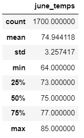
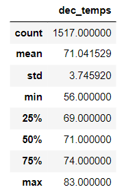
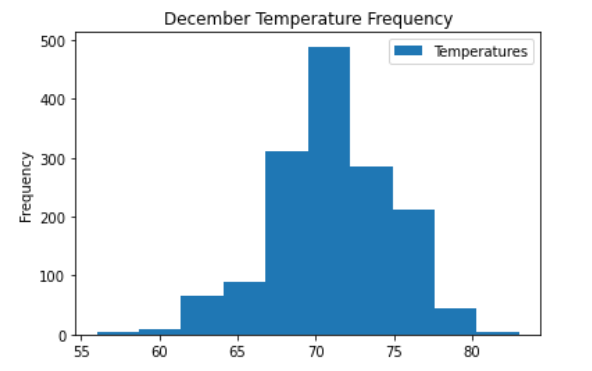

#Overview of the Surfs_up Analysis
    The purpose of this analysis was to determine if a combined surf and ice cream shop would be a successful business
in Oahu, Hawaii. After a preliminary analysis was completed, W Avy wants to see temperature trends for June and December in order to determine if this business will be sustainable in Oahu year-round. A successful surf shop in Oahu could help W Avy decide whether to expand his business to other islands.

#Results
    Results of this analysis are outlined below with bullets and supporting images showing summary statistics:
 
 - The minimum temperature for June was 64 degrees, while in December the minimum temperature was 56 degrees. This is a significant difference, but according to the December temperatures chart below the minimum seems like one of a few outliers and does not represent the typical temperature.
 - The maximum temperature for June and December was 85 and 83 respectively, showing very little difference between months. Again, these high temperatures tend to be outliers and are not typical temperatures for either month.
 - The average temperature for June and December was 75 and 71 respectively, only a small difference of four degrees for each month. This suggests consistent surf temperatures regardless of time of year, as the mean is a much better indicator than the minimum or maximum temperature.
 

#Summary
    Results show that the temperature is pretty consistent throughout the
year, with the mean for both June and December only being four degrees apart. The standard deviation for June was 3.26, with December's standard deviation at 3.75. While there are slight differences, June and December seem to have mostly similar temperature conditions for surfing.

    Two additional queries:
    - One additional query that would yield a better picture of weather
patterns in both months would be a query to show wind conditions.
    - Another useful query would be to examine rain patterns in June and
December, as temperature may be similar, but one month could have significantly more rain.
